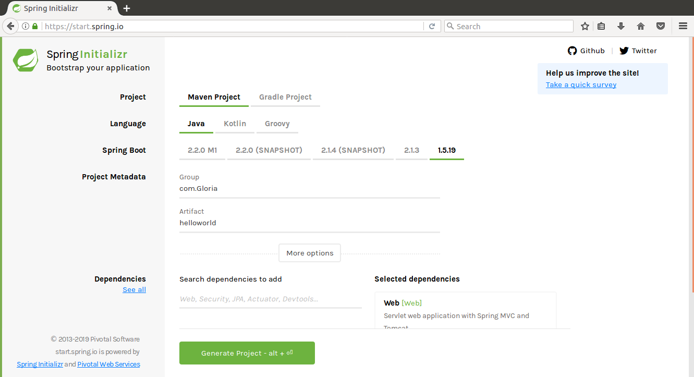
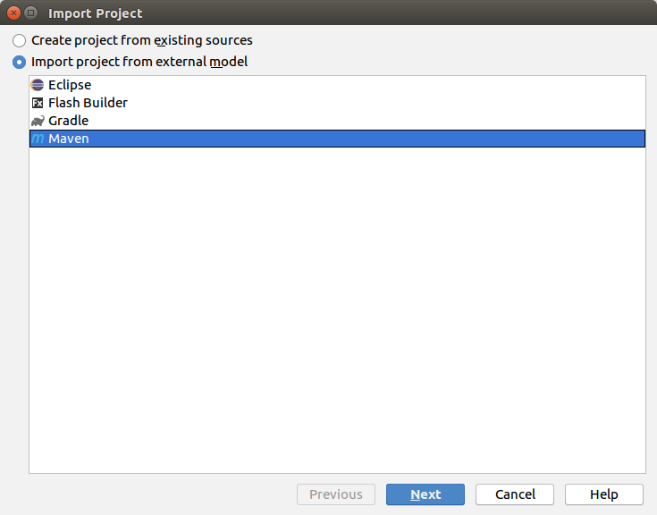
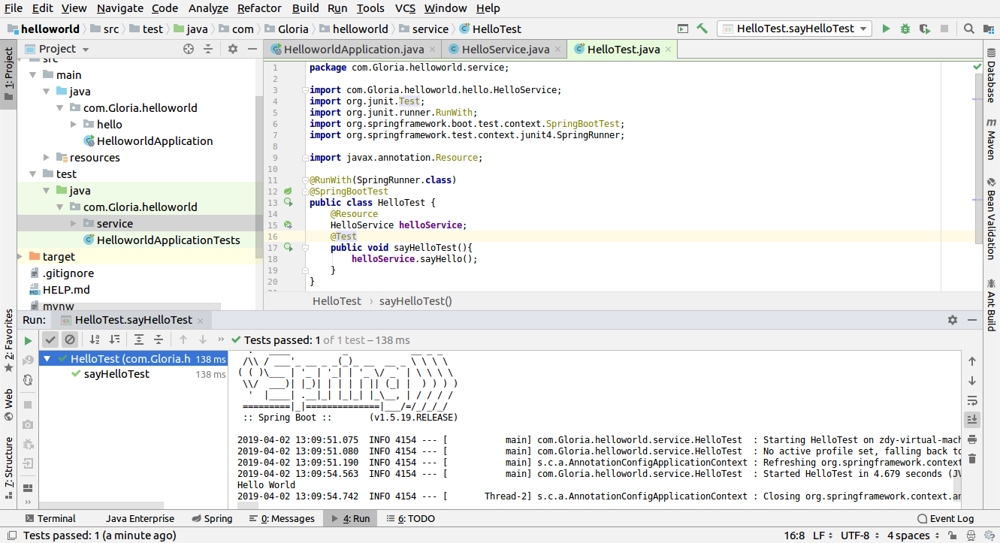
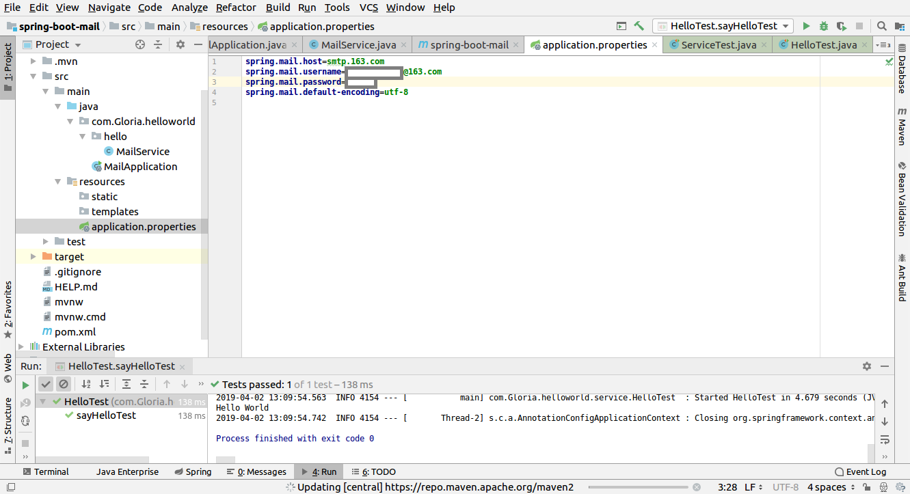
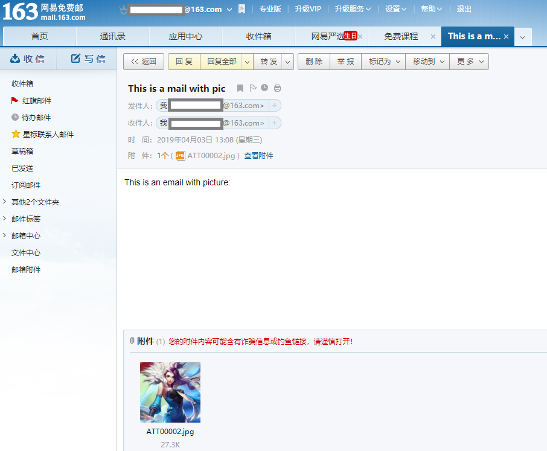
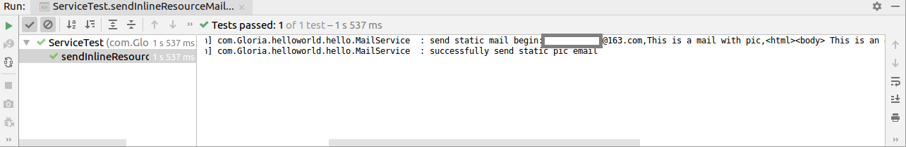

## 1.Sping boot 起步

这次是通过start.spring.io配置springboot，如图所示，按图中选择，生成一个压缩包，解压在工作目录下。

在IDEA中选择File--New--Module From Existing Sources，然后选中解压好的文件，一路next就ok了。

跟上次一样，先编译pom.xml。

在main文件夹下的com.Gloria.helloworld文件夹下新建一个hello文件夹，在里面新建一个HelloService类，这个类的作用就是输出“Hello World”

在test文件夹下的com.Gloria.helloworld文件夹下新建一个service文件夹，在里面新建一个HelloTest类，点击@Test，右键运行，结果如图所示。

## 2.项目配置

将刚才的helloworld工程复制到工作目录下，重新命名为spring-boot-mail，重复1的过程，将模块导入，然后把该改的文件夹的名字和方法名字都改一下，比如说HelloworldApplication改成MailApplication

需要加入mail依赖。

这里出现了一些问题，在pom.xml文件中加好了mail依赖以后编译，显示着build success，但是External Libraries里一直没有导入进相关的jar包，照着网上的方法，比如reimport都没用，后来试着把版本从1.5.19改成2.0.4，刚开始也不好使，后来不知哪次的reimport操作就好使了，这里我也不知道怎么回事。后面添加thymeleaf依赖的时候就很成功，一次就成功了。

如图所示更改resources文件夹下的application.properties，注意密码不是邮箱登陆密码，而是授权码，登陆163邮箱，点击设置，点击POP/SMTP/IMAP选项，然后点击左侧菜单的客户端授权密码，生成授权码即可

## 3.文本文件

**请注意：测试类中@Test中的方法访问权限必须是public**

实验中遇到的问题：报错java.lang.IllegalStateException: Found multiple @SpringBootConfiguration annotated classes

来自网上的解答：因为 spring-boot-mail 项目是我们之前从helloWorld直接复制过来的，所以会有之前生成的HelloWorldApplication.class 文件

解决方法：把 spring-boot-mail 这个项目 clean 一下，然后再compile 一下，其他不做任何修改，在去执行测试代码即可。在执行Execute Maven Goal输入指令时，注意选好你要执行的working_directory。

## 4.HTML邮件

执行步骤与3类似

## 5.附件邮件

代码里展现的是发送一个附件，其实可以带多个附件的，代码helper.addAttachment(fileName,file);中，把filepath写成数组遍历，改变filepath并执行多次addAttachment方法即可。

## 6.图片邮件

解释一下cid是怎么回事，以下解释来源于网络：

html语言可以带上图片链接（</img>），那么我们在发送邮件的时候就需要对这些链接的图片做特殊处理。否则在对方接收到邮件的时候会看不到图片。我们特殊处理的方法就是把它们当成附件发送，但不显示在附件里。要做到这些就首先需要对输入的content进行解析，找到所带图片的路径。然后把content中</img>这段代码变成</img>

可能解释不完全准确，但是大体意思可以得知了。

结果如下图所示。正常来说，邮件正文部分应该能显示出图片，可是我这里显示不出来，哪位小伙伴知道解决方法的话可以告诉我哈。

## 7.邮件模板

需要加入thymeleaf依赖。

在resources文件夹下的templates文件夹下生成emailTemplate.html文件，在系统自动生成的代码中添加自己的内容，别忘了在html标签中加入<html lang="en" xmlns:th="http://www.thymeleaf.org">。

我们利用邮件模板发送类似于注册点击链接激活的邮件，测试类执行后，在收到的邮件中点击链接会跳转到此github上来呦~~

## 8.异常处理

以发送图片的邮件方法为例展示了对异常的处理，包括加入日志等，效果如图所示。具体可以看代码。

**课程来源：慕课网**
